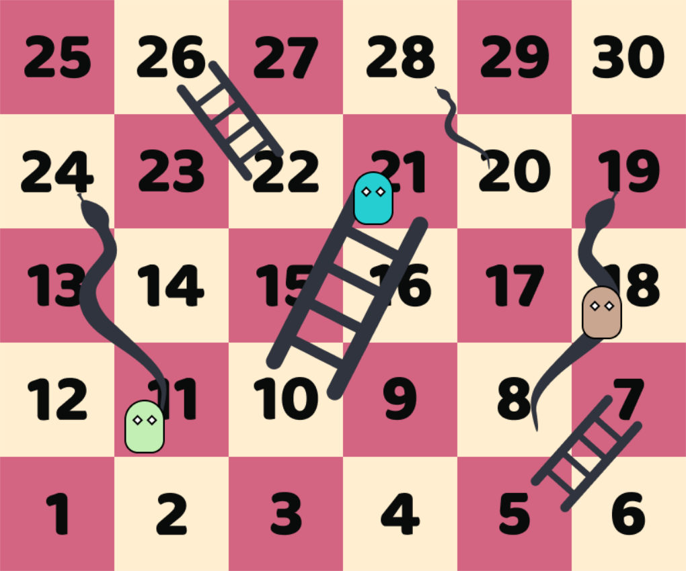
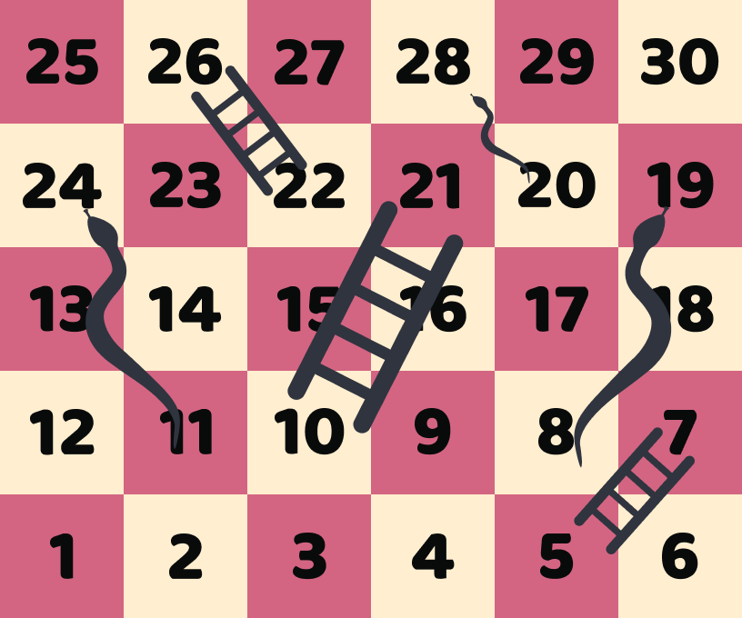

# Snakes and Ladders
 
 Welcome to the digital implementation of the classic Snakes and Ladders board game, designed as a university assignment.
 <div align="left">
 
 
 </div>

# Getting Started

To get started with this project, you'll need to have Python, Pygame and Pyllist on your system. Clone the repository, and you can run the game from the `main.py` script.

## Prerequisites
- Python 3.x
- Pygame
- Pyllist

## Installation
1. Clone the repository
```git
git clone https://github.com/m1zukash1/Snakes-and-Ladders.git
```
2. Navigate to the cloned directory.
3. Install Pygame and Pyllist
```
pip install pygame
```
```
pip install pyllist
```
4. Run the game:
```
python src/main.py
```

# How to Play
- Start the game by running the ``main.py`` script
- Players can take turn by pressing the ``SPACE`` key
- Once one of the players reaches the top, the game closes and states the winner in the console.

# Contributing
I am not accepting pull requests. This is a simple project I made for my university assignment that I have no intentions to work on further.

# The full task assigned by university lecturer translated into English

Create a replica of the "Snakes and Ladders" board game.

The game board consists of n consecutive numbered squares. Players start the game from 1st square, roll the dice and take the number of steps forward indicated by the dice. If a player stands on the square with the ladder, moves to the square indicated by the ladder (forward), and if the player stands on the square with the snake's head, moves to the square with the snake's tail (backwards). The winner is the first player to reach the last square.

The student can **adjust the rules of the game**, but the principle must remain the same.

The game's internal logic must use a **Doubly linked list**.

The application user can (4.5 points):
 - Edit game board:
   - Initialize board squares from .json file (1 point)
   - Manually insert board square (into position) (0.5 points)
   - Manually remove board square (from position) (1 point)
   - Overwrite board square (insert ladder or snake at a square) (1 point)
   - Clear the board (completely wipe information from board data structure) (0.2 points)
 - Play:
    - Start the game and set player count (up to 3) (0.2 points)
    - Roll the dice (0.2 points)
    - Exit to the menu (0.2 points)
    - Exit the game (0.2 points)
 - Miscellaneous functionality:
   - Game can house 1, 2 or 3 players (1.3 points)
   - Players are stored inside **Doubly linked list** (1 point)
   - If the player moves to a square on which another player already stands, that player steps one position down (0.5 points)
   - Players travel on board (0.5 points) *To this day I have no idea what my lecturer meant, and when I asked I just got a shrug ://*
   - When game ends - announce the winner (0.2 points)
 - User Interface:
   - Player positions are seen at any given time (0.5 points)
   - Clear feedback: when rolling a dice, what number was rolled; what is the special type on which the player stepped; how much the player moved. etc. (0.5 points)
- Game board square structure (1 point)
  - position
  - special type (normal, ladder or snake)
  - target
 
 ### Note
 The task did not ask to make a graphical game however the lecturer stated that we can receive extra points for doing so. I really wanted to make something with ``pygame``, so I took the challange. There are some tasks I did not fulfill; however, I received the maximum possible evaluation by receiving extra points for making a graphical game.
